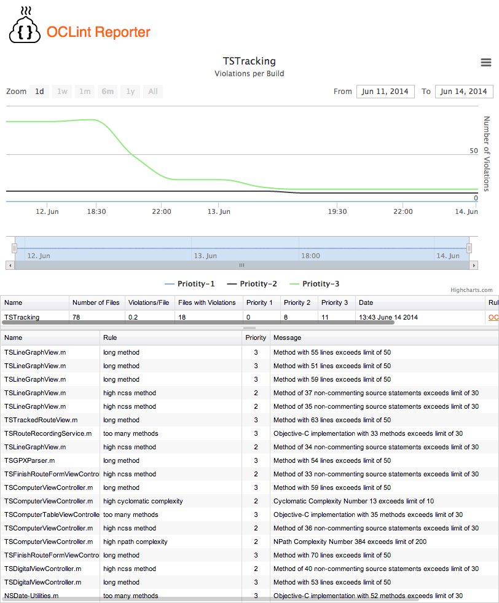

OCLintReporter
==============

This is a PHP framework for presenting your OCLint JSON reports in a comfortable manner. Just put OCLintReporter on your webserver and have OCLint generate your JSON reports in the reports folder.

Right now it implements enough to be usefull to me. I can sort the overview to workout which module needs work. I can drill down to view its violations and see the offending lines of code in github.

#Installation
Clone the repository into an folder used by your web server. Have [OCLint](http://oclint.org/) save the JSON reports in the reports folder. These will be picked up and displayed.

#Screenshots

##Overview
OCLintReporter gives you an overview first of all so you can see which classes are in worst shape. 

##Details
You can then drill down into the specific report to see the violations. You can sort by prioity, rule or file name.

##Clicking on a violation will show you the code on github.

##Credits
The logo is based on Poop by Mayene de La Cruz from The Noun Project.