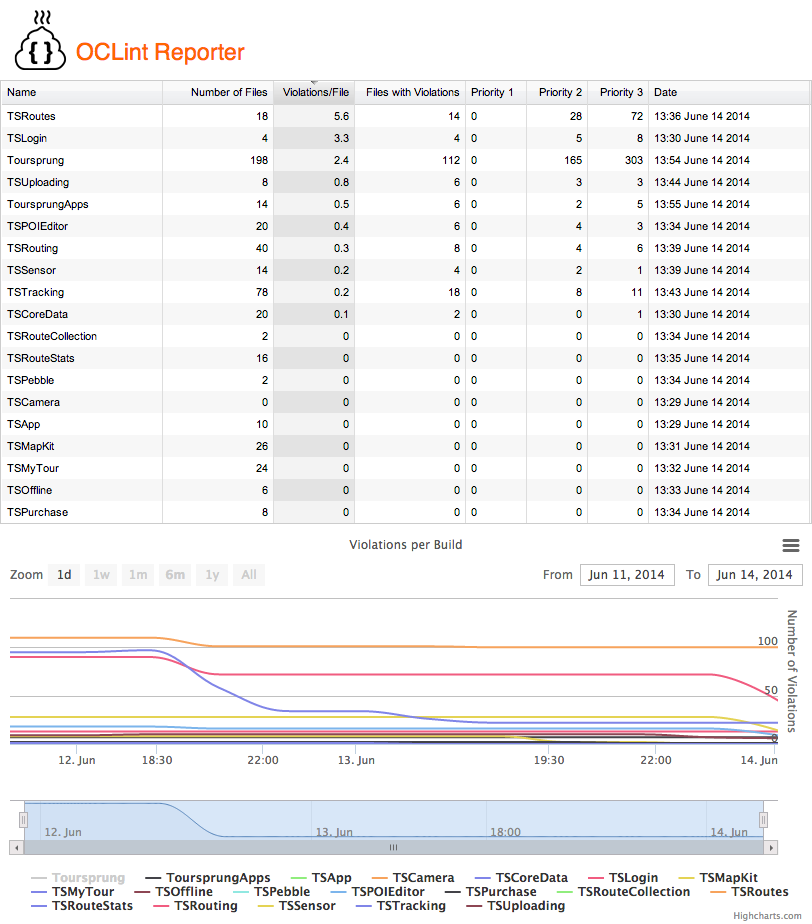
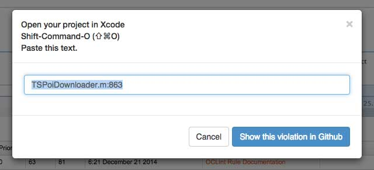

 
OCLint Reporter
==============

OCLint Reporter is a web application for presenting your OCLint JSON reports in a comfortable manner. Just put OCLint Reporter on your webserver and have OCLint generate your JSON reports in the `reports` folder.

Right now it implements enough to be usefull to me. I can sort the overview to workout which module needs work. I can drill down to view its violations and see the offending lines of code in github.

#Installation
Clone the repository into an folder used by your web server. Have [OCLint](http://oclint.org/) save the JSON reports in the `reports` folder. These will be picked up and displayed.

##Continuous Integration (Jenkins, Bots, etc.)
It is useful to automate the creation of the JSON reports required by OCLint Reporter. An example shell script can be found on the [Continuous Integration Wiki page](https://github.com/onato/OCLintReporter/wiki/Continuous-Integration).

#Screenshots

##Overview
OCLint Reporter gives you an overview first of all so you can see which classes are in worst shape. 

##Details
You can then drill down into the specific report to see the violations. You can sort by prioity, rule or file name.

##Clicking on a violation will show you what to paste into the Open Quickly dialoge in XCode.

###Or take you to the line of code in GitHub for projects stored there.

##Trouble Shooting
If the graphs do not dispaly, check that the data directory has been created. If not, make sure the webserver user has write access to file system.

##Credits
The logo is based on Poop by Mayene de La Cruz from The Noun Project.